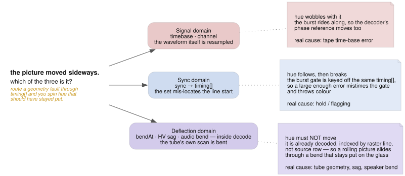

# ntsc.js architecture

Orientation for someone (or something) about to change this codebase. It covers
the shape of the system and the invariants that are easy to violate, not an
inventory of every file.

## The premise

ntsc.js simulates the NTSC signal path, not the _look_ of one. There is no "VHS
filter". A picture is encoded to a real composite waveform on a fixed raster,
damaged in the ways real hardware damages a waveform, then decoded by a model of
a TV that has to find sync in whatever it is handed. Dot crawl, rainbow
fringing, tearing, rolling and hue drift are **emergent** — nobody draws them.

That premise is the main design constraint: when adding an effect, prefer
modelling the mechanism that causes the artifact over drawing the artifact. The
payoff is that mechanisms interact for free, which is where the interesting
output comes from.

## The layout

`src/core/` is the simulator; the rest of `src/` is the instrument built on it.
Core holds the pass graph and its WGSL (`core/gpu/`), the per-frame CPU state
that feeds them (`core/signal/`), the control schema every layer shares
(`core/controls.ts`), and the three utilities both halves use. Around it,
`src/ui/` is the panel and the React that drives one, `src/sources/` is where
pictures come from, and `src/vote/` is the labelling tool that builds a
preference dataset out of the engine.

**Nothing under `core/` imports the app.** An engine runs against a canvas and a
`Controls` object, which is why `src/vote/` can stand up its own engines without
touching a line of the panel. An oxlint override on `src/core/**` fails the
build on an import reaching back out — to `ui/`, `sources/`, `vote/`, React or
firebase, and type-only imports count. Where core needs a shape the app owns,
core declares the shape and the app satisfies it: `core/gpu/videopump.ts` does
that for `Relay`, `PullOpener` and `FramePull`, so the pump names what it
depends on instead of naming who builds it.

The boundary is a directory, not a package. Core has no build of its own, the
app imports its source, HMR crosses the line freely, and the doc tests read core
files by path. Making it a workspace package is a separate decision, and what
would make one worth taking is somebody outside this repo wanting to install it.

## The raster

Everything hangs off `src/core/signal/constants.ts`:

| quantity         | value                           |
| ---------------- | ------------------------------- |
| sample rate      | 4 × F_SC = 14.31818 MHz         |
| samples per line | 910 (= 227.5 subcarrier cycles) |
| lines per frame  | 525                             |
| active picture   | 754 × 480, starting at line 22  |
| line structure   | 67-sample sync tip, burst at 78 |

The composite signal lives in flat `array<f32>` buffers of 910 × 525 samples in
IRE units (sync −40, blank 0, black 7.5, white 100), indexed
`n = row * 910 + s`.

Parameters are authored in **physical units** (µs, Hz, IRE) and converted to
samples at the uniform-packing boundary. Keep it that way.

The model is 525 lines per frame at 60 fps, i.e. progressive. Real NTSC is
interlaced at _field_ rate with a half-line offset, which is why vertical roll
currently steps a whole frame at a time. That is the largest remaining
authenticity gap.

## Pass order

One frame, driven by `Engine.render()` in `src/core/gpu/pipeline.ts`:

```
prePasses    compose → encodeComposite → [feedA] → [composeB → encodeChromaB → encodeCompositeB → feedB → mixB] → [chyron] → [fbComposite] → [tapePlay → tapeRec]
loopPasses   chromaExtract → [underDown] → channel → timebase     (× dubGens, ≤ 4)
postPasses   [enhancer] → [buzzTap] → syncMeasure → sync → lineAnalyze → [vir] → [caption] → decode → crtFace → [storePrev]
present      render pass to the swap chain
```

That block is not decoration: `src/core/gpu/pipeline-graph.test.ts` parses the
three arrays out of `pipeline.ts` and fails if this order, or which names are
bracketed, no longer matches. `docs/graphviz/pipeline.dot` draws the same order
with the buffers on the arrows and is held to the same list:

<picture>
  <source media="(prefers-color-scheme: dark)" srcset="img/pipeline-dark.svg">
  
</picture>

Bracketed passes are gated by a `when()` predicate on the controls, so an idle
feature costs nothing. `loopPasses` runs once per tape-dub generation, with
per-generation params copied over the live buffers in between so each pass gets
its own noise and time-base walk.

Two dispatches sit deliberately outside those arrays, because they are not the
signal path. The grain bake (`grain_bake.wgsl`) runs once at engine
construction: the phosphor mottle is fixed to the glass, so `crtFace` reads it
as a texel instead of hashing it per frame. The other is the direct video blit
(`blit_ext.wgsl`), which is input staging — where the device has
`importExternalTexture` (Chrome, feature-detected), a slot's fresh video frame
is sampled straight off the browser's decoder into the slot texture at the top
of the frame, replacing the bitmap path's per-frame CPU decode/resize/upload.
Firefox has no such API and stays on `VideoPump`'s bitmap path unchanged.

The split matters: **encode** builds the waveform, **channel/timebase** damage
it, **enhancer/sync/decode** is the receiver trying to make sense of the damage.
An effect belongs in the stage that physically causes it. `enhancer` is an
outboard box between the deck and the set — it runs after the last dub
generation and before anything measures sync, so the pulses it stamps are the
pulses the receiver has to lock to.

**Each input also has its own feed** (`feedA`, `feedB`) — the deck, cable and
head-end between that one source and the mixer, so a fault there (scramble,
termination, snow, polarity, a ground loop, a loose plug, the pause button)
damages one signal alone and everything downstream reacts to the difference. The
two passes are one shader bound to different uniform buffers: `renderFrame`
packs each source's fault controls — and its paused deck's servo state — into
the standard damage fields of a second `Params` block, so each mechanism is
written once in `feed.wgsl` and reused fields cost no `PARAM_DEFS` growth.

That reuse sets one trap, and it is the trap to know before adding a per-source
fault. `packFeed` spreads the program-bus pack and overrides only the fields
`FEEDS` names, so **every other `Params` field reaches a feed still holding the
bus's value**. A block in `feed.wgsl` that reads a field nobody overrode applies
a program-bus knob to one source and looks like it works. The declaration is
therefore one table entry (`feedgates.ts`), one `packFeed` override, one shader
block, and one line in `feedFaults` — and `feedgates.spec.ts` fails if the last
is missed, because a fault the gate does not know about dispatches no pass and
its slider does nothing until some unrelated fault on the same input is up.

An engaged feed makes its encoder detour through the `compB` scratch (a
bind-group pair swapped off the same predicate that gates the feed). What makes
feedB possible at all is `encodeCompositeB`: B exists as a real composite on its
own raster, which `mix_b`'s dirty path then resamples — so B's damage, its pause
stripe included, rides B's raster through the slip and roll instead of parking
on the output.

## The three domains

The single most important distinction in this codebase, and the easiest to get
wrong. A horizontal displacement can come from three places, and they are _not_
interchangeable — what tells them apart is what happens to hue:

<picture>
  <source media="(prefers-color-scheme: dark)" srcset="img/domains-dark.svg">
  
</picture>

- **Signal domain** (`timebase`, `channel`) — the waveform itself is resampled.
  The burst moves with the picture, so decoder hue wobbles too. This is tape
  time-base error.
- **Sync domain** (`sync` → `timing[]`) — the receiver mis-locates the line
  start. The burst gate is keyed off the same `timing[]`, so it follows, and a
  large enough error mistimes the gate and throws colour off. This is hold /
  flagging.
- **Deflection domain** (`bendAt`, HV sag, audio bend, all inside `decode`) —
  the tube's own scan is bent, downstream of decoding. Hue must **not** move,
  and these are indexed by _raster line_, not source row, so a rolling picture
  slides through a bend that stays put on the glass.

Before adding a displacement, decide which domain causes it. Routing a geometry
fault through `timing[]` will spin hue that should have stayed put.

## Buffer layouts worth knowing

- **`timingBuf`** (`(LINES * 2 + 10)` floats) — `[0..524]` per-line horizontal
  offset; `[525]` vertical oscillator phase, signed and fractional; `[526]` PLL
  state; `[527]` AGC gain; `[528..531]` the two second-order gain servos (beam
  limiter and camera auto-iris, gain + velocity each — `sync` updates them,
  `decode` applies the ABL drive, `compose` applies the iris a frame late);
  `[532]` the sync separator's lock age, lines since the last real edge, which
  scales the free-running H-osc's phase noise so lock decays instead of
  coasting; `[SAG_BASE..]` normalized deflection sag per raster line;
  `[VIR_HUE]` and `[VIR_GAIN]`, past the sag region, the VIR corrector's two
  integrators — `vir` writes them, `decode` adds them to the demodulator's
  reference and to its chroma gain. Indices 525–532 and the two VIR slots are
  persistent across frames; treat them as state. A zeroed `VIR_GAIN` means the
  servo has never run, which is what lets `resetSignal` clear the whole buffer
  and still hand the loop a sane start.
- **`lineParamsBuf`** — one `vec4f` per line from `LineState`:
  `(tbOffsetSamples, underBasePhase, underJitterPhase, seed)`. All four slots
  are taken; a new per-line CPU quantity needs its own buffer.
- **`syncMeasureBuf`** — one `vec4f` per line from `sync_measure`:
  `(sync edge or −1000, sync depth, mean beam load, broad-pulse flag)`.
- **`audioBuf`** — one float per line, the audio waveform at line rate.
- **`buzzBuf`** — one `vec2f` per line from `buzz_tap`: the line's mean
  composite level and the RMS of its within-line deviation, both IRE. The
  traffic in the opposite direction to `audioBuf`, and the app's **only
  steady-state GPU→CPU readback** — `gpu/buzzread.ts` maps it through a pool of
  three staging buffers and skips the frame when none is free, because the sound
  side can glide over a gap and the render loop cannot afford to wait. Gated on
  the buzz being audible at all, so an idle listener pays nothing.
- **`tapeBuf`** — the delay loop, `TAPE_FRAMES` (120) composite frames as f16
  pairs packed into `u32`, two seconds at 60 fps for 109 MiB. It is a _medium_,
  not a frame store: `tapeRec` writes the slot `frame % TAPE_FRAMES` and
  `tapePlay` reads it back through up to four heads at their own distances
  behind, so the same stretch of tape carries the same grain, the same worn
  patches and the same splice round after round. Two consequences to respect.
  **The delay arrives split** — `tapeDelayFrames` (whole frames) plus
  `tapeDelaySamples` (the remainder) — because the ring holds 57 M samples and
  an f32 stops counting integers singly at 2²⁴; position arithmetic in
  `tape_play.wgsl` is `u32` for the same reason. And **`tapePlay` must run
  before `tapeRec`**, which is what makes the maximum delay a full ring rather
  than one frame short of it — and is the thing to hold in mind when touching
  the hold window, because while recording frame _f_ the newest tape on the loop
  is _f−1_, so the window has to step on once more as the record head lifts or
  the last frame recorded is the one frame that never plays back.
- **`persistBufs`** — phosphor state (the light still on the glass), packed
  `rgba8`, ping-ponged by frame parity: `decode` reads one and writes the other,
  because its lateral scatter reads neighbouring pixels and a single buffer
  would hand it values the same dispatch is part way through overwriting.

## Params are generated, not hand-written

`PARAM_DEFS` in `src/core/gpu/prelude.ts` is the single source of truth for the
uniform struct: **field order there is the GPU memory layout**. It generates
both the WGSL `Params` struct and a typed `Record` that `packParams` consumes.
Adding a param to `PARAM_DEFS` without supplying it in `Engine.uniformValues()`
is a TypeScript error, by design — that is the guard against a silently-zero
uniform.

Adding a control end to end touches five files, and only the last is optional:

<picture>
  <source media="(prefers-color-scheme: dark)" srcset="img/controls-dark.svg">
  
</picture>

`PARAM_DEFS` has to come first — the type error it raises is what points you at
the remaining steps.

CPU-side per-frame state (`LineState`, `MixState`, `AudioState`) lives in
`src/core/signal/` and is either uploaded as a buffer or folded into uniforms.

## Direct-manipulation miniatures

A few controls describe a **position you can only judge on the output** — the
PiP inset window (`pipX/Y/W/H`), the wipe boundary (`wipePos`), and where the
magnifier is aimed (`crtZoomX/Y`). Those get a 4:3 miniature of the active
picture you drag on: `src/ui/PipFrame.tsx`, `WipeFrame.tsx` and
`MagnifierFrame.tsx`, over shared chrome in `MiniFrame.module.css` and the pure
geometry in `miniFrame.ts` (`lens.ts` for the magnifier).

The magnifier is also driven straight on the output: `Stage.tsx` turns a wheel
into `zoomAbout`, a drag into `panLens` or `zoomToBox`, and a double-click into
1x. All of it goes through `lens.ts`, which mirrors the transform in
`present.wgsl` — including the clamp that stops the lens looking past the edge
of the glass, so the miniature draws where the shader actually looks. That
mirroring is the thing to keep honest: change the transform in the shader and
`lens.ts` moves with it, or `lens.test.ts` starts lying.

Step 4 above still holds without exception: **every control keeps its slider.**
The miniature only hides the ones it duplicates, behind the group's `▸ sliders`
toggle. That is what keeps MIDI binding, clock sync, presets, scenes and URL
state working untouched — a miniature is another writer of a normal control,
never the only one.

The **fine tier** is the second sanctioned hider, under the same contract. A
`fine: true` on a `SliderDef` in `src/ui/controls.ts` marks a trim — a control
that shapes an effect some other control turns on — and `ControlGroup` folds
those rows behind a `▸ N fine tweaks` disclosure so a group's look-makers stay
scannable. Hidden, not removed: the row is one click away, a live filter
collapses the tier entirely so search and the ⌘K palette reach fine rows
directly, the group's touched dot and the phase roll-ups still walk every
slider, and the fold shows `· N touched` in the same amber when a preset has
moved something behind it. The tier is also the auto-map ranking (`AUTOMAP_KEYS`
puts non-fine controls first, then fine, then `VIEW_KEYS`), so a
knob-count-bound controller lands on look-makers first. Demotion criteria and
the vetoes that protect mode switches, preset-heavy keys and the
miniature-backed keys are pinned by `controls.test.ts`.

The **generator gate** is the third, and it hides a whole group rather than rows
inside one. Two groups in `src/ui/controls.ts` describe a generator instead of
the stage they are filed under — the noise source behind TV and VHS static, and
the video synth — because a group has to live somewhere and both are patched
into whichever slot is calling for them. Each carries `generator:` on its
`Group`, `generatorsLive` says which are actually running, and `panelChain.ts`
leaves a group off the Source A stage while nothing is running it, so a stage
headed by a picker reading `Webcam` no longer offers `Video synth (source)`
under it. Same contract as the fine tier: a live filter lifts the gate, so
search and ⌘K still reach every row, and the synth's liveness includes
`synthOver > 0` — patched _over_ slot A's picture it is a module in the chain
with no picker anywhere saying `synth`, and gating on the two source modes alone
would take the group off screen while it was drawing half the picture.

Two things to respect when adding another:

- **The frame is the shader's UV space** — 0..1 across the active picture, y
  down, the same `u`/`v` the pass computes. Anything the miniature draws or maps
  a drag through has to use the shader's own geometry. `WIPE_SHAPES` duplicates
  the pattern generator's distance functions from `mix_b.wgsl`, so
  `miniFrame.test.ts` pins them to the same values; change the pattern set in
  the shader and both sides move together or the test fails.
- **Don't draw what the engine is driving.** `wipeRate` sweeps `wipePos` inside
  `MixState` every frame, and the UI cannot see the effective value without
  re-rendering React at 60 fps (which the section above forbids). The frame
  marks the lever as driven instead of drawing a stale boundary.

Drags write through `writeControls` (one `applyControls`), so a gesture that
moves four controls is one notify, not four.

The **minor-adjustment card** is the third surface onto a control that is not
its own row, and it keeps the same contract. `vernier: true` on a `SliderDef`
gives the row a `minor` button opening a card that holds a second track spanning
one `step` of the control, in hundredths of it (`vernier.ts`, `Vernier` in
`Slider.tsx`). Nothing is stored for it: the card splits the value that is
already there into the notch of the step grid it is nearest plus a remainder, so
a trimmed control is one number like any other and a preset, a link or a MIDI
knob writes it without knowing the card exists. Two things this leans on — a
control's `step` is what the row's shared readout column and its curve are both
sized off, so the extra two digits are printed on the card (`formatFine`) and
never in the column; and `snapToStep` rounds a half up, which is why the
remainder runs [-50, +49] and no value sits on a tie the card's thumb would jump
across mid-drag. Take one where a control's step is a floor the mechanism can
see past — the camera loop's geometry — rather than wherever a finer number
might be nice.

Nothing in a miniature may run per frame — no `rAF`, no transitions or
animations that recalc style each tick. The panel shares a main thread with a 60
fps canvas, and a decorative pulse measured 7 ms of style recalc per 3 s for
information a static border carries. Measure with `page.metrics()` deltas
(`RecalcStyleDuration`, `ScriptDuration`), not fps: the loop is vsync-capped, so
fps stays at 60 until the budget is already gone.

## Performance shape

[`OPTIMIZATIONS.md`](OPTIMIZATIONS.md) is the long form of this section — why
the path is gated, tiled, tiered and packed the way it is, with what measured
each one and what was tried and reverted.

Where the frame time goes (see `DEVELOPMENT.md` › Measuring performance for the
protocol and the current numbers): every built-in preset fits comfortably in a
60 Hz budget on the dev box; the settings that genuinely cost are dub
generations with colour-under (the `channel`/`underDown` pair per generation), a
beam spot pushed past a pixel, a many-headed tape loop, and per-source feed snow
— and they stack. Live frame rate is a different budget from batch GPU
throughput: video decode/upload lands on it, and the display's vsync steps it in
jumps. That wavering is what `frameLock` exists for — it renders every Nth
refresh and submits _nothing_ in between (a held re-present made Firefox's
scheduler slow rAF delivery itself), trading rate the display was stepping
anyway for a cadence that holds still; `auto` engages it from the loop's own
interval spread and probes back on a backoff. Note before optimizing shaders
here: three ALU micro-optimizations have measured exactly zero (the FIR passes
are not ALU-bound), so ablate an upper bound first. The same rule caught a
startup one: the constructor's 22 blocking `createComputePipeline` calls look
like an obvious `createComputePipelineAsync` job and are worth 9 ms in total,
while the async path measured far slower — see DEVELOPMENT.md.

Almost everything is comfortably parallel. Two exceptions:

- **`sync.wgsl` is two lanes in two waves** — the PLL flywheel and the HV sag
  are each a 525-iteration loop on one lane, and they run side by side. They
  must be serial: each line's value depends on the previous line's. It is
  latency on a lane rather than GPU throughput, and it measures fine at 60 fps,
  but it is the one pass that cannot scale. Another per-line recurrence should
  be a parallel prefix-scan instead of a third loop here.
- **`decode` stages a shared tile per row.** A workgroup covers 64 pixels of one
  raster row and stages a contiguous span with a 32-sample halo, so the demod
  FIR reads workgroup memory. Consequence: horizontal offsets must be
  **row-uniform**. Per-pixel horizontal scaling (H size, linearity, pincushion)
  would read outside the halo and needs the staging restructured first.

## The React layer

React only ever configures the engine — it never renders a frame. The render
loop lives in `useEngine` and writes to the canvas directly, so live per-frame
state (fps stats, resolution) reaches the overlays as **mutable refs read during
render**, rather than re-rendering React at 60 fps.

Three things share one frame and run in a fixed order: `glide` (morph) walks the
resting values, then `applyMod` drives routings and restores, then `applyStab`
replaces the board and restores. Each subsection below says why that order.

### A lost device is rebuilt in place, not reloaded

Sleep/wake and driver resets fire `device.lost`, and they are the losses a
session should survive: `onDeviceLost` builds a replacement engine and hands it
back the controls, the debug tap, B's enable flag and both slots' sources, so
the only thing the user sees is a banner for the length of a `requestDevice`
(measured well under 100 ms on the dev box). Three consequences bind anything
that touches this:

- **The outgoing engine stays the store until the swap.** React reads controls
  from the engine via `useSyncExternalStore`, so nulling `engineRef` during the
  gap would flash every slider to its default and lose any write made in the
  meantime. The dead engine keeps taking writes — they are plain JS — and the
  snapshot is copied across at the moment the replacement goes live.
- **The audio graph moves over rather than being rebuilt** (`Engine.create`'s
  `audio` option, `destroy({keepAudio: true})`). A media element binds to one
  `AudioContext` for life, so a fresh graph could never re-adopt the clips still
  playing — `createMediaElementSource` throws on the second call for an element.
- **Every source reaches a slot through `VideoSlot`'s three setters**, which is
  what makes the restore possible: `useEngine` records what each slot was last
  handed (`SlotSource`) and replays it. A live `<video>` is the browser's, not
  the device's, so a clip, a webcam or a screen share only needs re-attaching;
  only stills and noise fields are re-issued. Adding a fourth way to set a
  source without going through a slot would silently lose it across a loss.

What does _not_ come back is the content of VRAM — phosphor state, the frame
store and the tape loop all restart empty. `onHang` is deliberately **not**
rebuilt: a wedged GPU process is shared across tabs and outlives the page, so a
fresh device would land on the same one. That one still goes to `FatalScreen`.

### React Compiler is on

Via `reactCompilerPreset` and `@rolldown/plugin-babel` in `vite.config.ts`.
Don't add `useMemo`/`useCallback` — memoization is the compiler's job. Two
consequences worth knowing:

- **The ref-during-render pattern above is exactly what the compiler refuses.**
  A bail-out is harmless in itself — the compiler leaves that code as written —
  but it costs that component its memoization, which is why every one of them is
  recorded rather than tolerated: `KNOWN` in `scripts/compilercheck.mjs` is the
  live list, with a line per bail-out saying whose fault it is, and
  `pnpm compiler` fails on any that is not on it. Read that list rather than one
  written out here, which drifts the moment a component is renamed or fixed.
  `useEngine` itself does compile (it only returns the refs, never reads one for
  render output within its own body) — a bail-out lands on a caller that reads
  one. Pulling a ref out of props with a destructure is what keeps that from
  spreading: read as `props.someRef`, the compiler marks the whole props object
  ref-ish and refuses every other `props.x` read in the component. oxlint's
  `react` plugin (`.oxlintrc.json`) has no rule equivalent to
  eslint-plugin-react-hooks' `refs` (which used to flag this on principle), so
  there's nothing to suppress; `react/rules-of-hooks` and
  `react/exhaustive-deps` still run and report real bail-outs.
- **What is load-bearing is that a callback held in a dep array keeps its
  identity.** `useClockSync` holds `writeControl` from `useMidi` in an effect
  dep array; if that closure got a fresh identity per render the effect would
  re-fire constantly and `midi.setExternal` would reset soft-takeover every
  render, so a physical knob could never hold its catch. `useMidi` therefore
  keeps hand-written `useCallback`s (`useMidi.ts:57`) rather than trusting the
  compiler — the invariant is correctness, so it is stated at the definition
  instead of inferred from build output. Note the consumer's own status is
  irrelevant: a compiled consumer still re-fires on a changed identity.

### Two panel contexts, deliberately

`ControlsContext` carries the controls and the verbs a row needs;
`ModSlotsContext` carries the modulation bay. They are separate because they
change on completely different clocks — a slider drag rewrites controls on every
pointer move, while the bay changes only when someone patches it — and one
shared context would rebuild every consumer of both on each drag frame.

### The modulation bay

The bay lives in React (`useModSlots`), never in the engine. `setModSlots` is
write-only by design: the engine applies routings by mutating `controls` for the
duration of one frame and restoring after (`pipeline.ts`, `applyMod`), so a
modulated value never comes back out of `getControls` — which is what keeps
presets, scenes, links and the sliders showing the resting look. Two
consequences worth knowing before touching it:

- **Slot position is identity.** `ModState` keys each wave's phase and its noise
  seed by the slot's index, so a stale routing must be blanked in place rather
  than filtered out; compacting hands one slot's running phase to another and
  restarts everything below it.
- **Modulating one of the five filter controls** (`encChromaMHz`, `demodMHz`,
  `chromaTail`, `lumaMHz`, `lumaPeak`) rebuilds the FIR bank every frame. Fine
  as a deliberate patch, which is why the UI allows it; not fine hanging off an
  authored preset, which is why `presets.test.ts` forbids it there.

### Morphing is the opposite of modulating

`signal/glide.ts` walks the _resting_ values from where they were to a
destination over a span of seconds — a preset, a roll or a scene arriving slowly
instead of cutting — so unlike `applyMod` it does not restore afterwards: a
morph lands, stays landed, and comes back out of `getControls` because the board
really is there now. It runs immediately before `applyMod` in `render()`, which
is what makes an LFO wobble around wherever the morph has reached rather than
around a resting value the board has left. Three things it has to get right, all
of which are the reasons it is not a `setInterval` writing controls:

- **React hears about it a tenth as often as it happens.** `GLIDE_NOTIFY`
  batches the notify to every sixth frame. Notifying per frame is a full panel
  render per frame (19ms with every row mounted) — the morph paying for its own
  stutter — and the landing frame always notifies regardless, because the
  destination is a look scenes, links and the recipe chips all have to agree on.
- **The landing frame assigns the destination** rather than evaluating the path
  at `t=1`: `from + (to - from) * 1` is not bit-identical to `to`, and
  `controlsEqual`/`matchPreset` compare exactly.
- **The filter five are stepped, not swept** (`COARSE_STEPS`), since a morph
  moves all of them at once and would otherwise be the cheapest way to buy sixty
  bank rebuilds a second.

Which controls may travel is decided in the UI layer (`ui/morph.ts`) and passed
in, because it needs the slider schema: modes (`choices`) cut at the half-way
point since there is no value between two phosphors, and `VIEW_KEYS` never
morphs at all.

### The stab gate

`signal/stab.ts`, `applyStab`. It replaces the _whole board_ with
`DEFAULT_CONTROLS` for a few tens of milliseconds several times a second — a
clean picture with the look poked into it, rather than the look running
continuously. Like `applyMod` it restores at the end of the frame, so the
sliders never move; unlike it, there is nothing to point at a target and no
depth, because it drives everything at once. It runs immediately **after**
`applyMod` and restores immediately before it, so a clean frame is clean
including whatever the LFOs were doing to it. Three things it has to get right:

- **`STOCK_HOLD` (`src/core/controls.ts`) is held back.** The engine cannot read
  the panel's `VIEW_KEYS`, so it carries its own copy of the same five keys, and
  `ui/controls.test.ts` asserts the two match. Without it the gate yanks the
  magnifier and rechooses the frame lock several times a second — which
  hold-to-compare gets away with because it happens once, under your finger.
- **`filtersDirty` is set on the two edges of a cycle and on no frame in
  between.** Every frame inside one half holds the same values, so the bank
  designed on the way in is still the right bank. Marking each clean frame
  instead is a FIR redesign at the frame rate, which is the whole cost of this
  landing in the wrong place; at 2Hz the edges cost four rebuilds a second,
  which is what `COARSE_STEPS` already spends on a morph.
- **The rate is read off the wall clock**, not off a frame count. `ModState`
  advances on a fixed `1/60`, so a 2Hz LFO is 1Hz on a 30fps machine; a train
  you count along with — and lock to a beat — cannot afford that. The length is
  milliseconds rather than a duty cycle for the same reason: doubling the rate
  must not halve the hit.

The gate lives in the modulation bay (`useModSlots`) rather than in
`DEFAULT_CONTROLS`, and that is deliberate. It is a clock over the whole board,
which is the family the routings beside it belong to, and it wants the tempo row
already at the top of that section. As a control it would need a slider in some
`GROUP` — the panel gives every control exactly one row and `controls.test.ts`
holds that — which means a stage on the chain map for a thing that gates every
stage; it would also have to be exempted from mutate and from its own sweep to
stock, since a control that cleans itself twice a second stops being one.

To check what compiled, build unminified and look for the memo-cache preamble:

```sh
pnpm exec vite build --minify false
grep -n "import_compiler_runtime.c)(" dist/assets/*.js   # one per compiled fn
```

## Testing

Two things here are architecture rather than procedure; the harnesses, the traps
they have hit and the performance protocol are all in
[`DEVELOPMENT.md`](DEVELOPMENT.md).

- **WGSL is validated statically.** `src/core/gpu/shaders.test.ts` prepends the
  real prelude to every `.wgsl` and runs it through naga, because WGSL is
  otherwise only compiled inside the browser and a typo would survive until
  runtime. Optional locally, enforced under CI.
- **A session is configurable entirely from the URL.** The engine is exposed as
  `window.vf`, and `?iurl=`, `?iurlb=`, `?preset=`, `?set=` and `?dbg=` mean a
  harness never has to click the UI. That is why the harnesses are as short as
  they are, and it is worth preserving when adding UI.

## Conventions

`CLAUDE.md` is the source; the one that shapes this codebase most is that
comments explain _why_ — the physical mechanism being modelled — not _what_.
