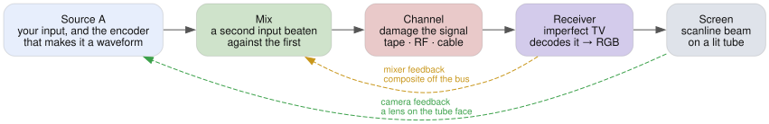

# Features

Every control breaks a piece of hardware rather than drawing an artifact. Dot
crawl, rainbows, tearing and hue drift are what falls out — which is why two
controls compound instead of just stacking.

This page is the tour: what each stage is, and the one thing about it worth
knowing before you turn anything. [Effects](EFFECTS.md) is the full list of
controls, generated from the app's own control table.

<picture>
  <source media="(prefers-color-scheme: dark)" srcset="img/pipeline-simple-dark.svg">
  
</picture>

## Sources and wiring

Two decks. Either takes a still, a video file, a shared screen, colour bars, TV
or VHS static, a video synth, or a teletype card you type on — plus your own
clip shelf and a roll out of Wikimedia Commons and archive.org. Source A also
takes a webcam, which is how an RCA capture dongle gets real gear in; source B
does not.

Then the faults, starting at the connector: snow, a loose plug, a ground loop, a
termination fault, polarity flips, S-video miswired into composite. Cable
scrambling, Macrovision AGC pulses and colorstripe are the interesting corner —
they work by playing the receiver's own AGC and burst circuits against it.

Source A can also arrive as a file that was already a tape: a capture group
models the deck it was digitised off — luma and chroma bands, Y/C delay, grain
and the colour-under carrier's blotchy noise — before the chain encodes it, so
the tape damage downstream lands on a picture that was a tape to begin with. Off
by default, and free while it is.

Each input also has its own deck and cable ahead of the mixer, so a fault can
hit one source alone. Knock out one input's sync and the receiver locks to the
other, and the geometry snaps between two pictures.

## Feedback loops

Three, and they differ in what goes round — each in the app's own words, since
the chain map opens every one of them with the same description:

<!-- generated:loops — from LOOP_STAGES in src/ui/controls.ts, via scripts/docgen.mjs -->

**Camera feedback**: light rather than wire — a camera on the tube’s face, its
picture mixed back into the input ahead of the encoder. It carries an image that
has already been decoded and lit, so it can only do what a lens can: zoom,
shift, defocus, cut a black level. Past unity gain it breeds structure on its
own.

**Mixer feedback**: the composite itself, patched off the bus into an input and
crossfaded against the live signal. The subcarrier rides round with it, so each
sample of cable delay spins fed-back hue 90° a generation and colour does things
optics cannot.

**Tape loop**: a second machine threaded with a loop of tape, patched across the
bus rather than round the chain: a play head returns what was laid down a lap
ago, a record head lays the sum back down, and whatever keeps circulating ages a
generation every time round.

<!-- /generated:loops -->

The tape loop is the one to keep straight: it is a second machine threaded
across the bus, where the Tape stage below is the deck this signal was played
back on. Its return gets recorded again, so repeats decay by generation loss
rather than by a fader, and chroma dies first.

## A/B mix

B genlocked onto A's raster for a clean dissolve, or summed dirty and
free-running against it, which is the two-deck rig.

The keyer cuts the chroma the encoder made, and that filter has no vertical term
— so mattes come out soft across and razor sharp down, the way every composite
key was.

## Tape and channel

Everything between the recorder and the set: bandwidth, nonlinearity, noise, the
tuner, colour-under, and the tape and heads themselves. The whole stage runs up
to four times, one per dub generation.

The one worth knowing: noise out of an FM discriminator rises toward the top of
the band, which lands it in the chroma passband, so tape noise arrives as
crawling coloured speckle rather than grey grain.

## Enhancer

A consumer enhancer between the deck and the set, with its jumpers moved. The
clamp gate slides off the back porch so black level bounces line to line; the
peaking coil gets feedback wrapped round it and rings; the sync regenerator
restamps pulses wherever its slicer crosses — bend that up into picture and dark
content starts minting sync of its own.

## Receiver

A television, and the ways one can be misadjusted. Sync faults move the picture;
decoding faults move its colour.

Deflection bend happens after decoding, so it warps geometry but must not touch
hue. That distinction — whether a wobble takes the colour with it — is the one
worth having in front of the app.

## Screen

The beam, and the phosphor it lands on.

Persistence decays second-order rather than exponentially, so a trail is a
bright front over a long faint tail — and it goes green, because red and blue
die first.

## Audio-reactive

Audio patched into the electronics at one sample per scan line, driving the
faults above rather than adding new ones: bass into vertical hold and HV sag,
level into horizontal hold, the waveform into deflection or into the
demodulator's reference.

That last one turns the tint 15,734 times a second. The reference lives in the
receiver, so the colour bands stay on the glass while a rolling picture slides
through them.

## Intercarrier buzz — the traffic the other way

**Sound buzz** is the only effect here you listen to. The sound detector
recovers the 4.5 MHz beat between the picture and sound carriers, and a limiter
that cannot keep video crosstalk off it hands you the picture as audio: the
vertical interval as a 60 Hz buzz, line structure as a whine, snow as hiss.

It is a tap on the real composite rather than a synthesised noise, so the faults
above arrive already in the right relationship to what you can see. Bright
scenes buzz louder because peak white overmodulates. Hum bars beat against the
field rate. A head switch clicks on the line it damages. Fine tuning frees the
carrier and makes the weave and the buzz worse together, because they are one
leak seen from two ends.

The tap sits ahead of the receiver, which is where a real set's sound detector
sits too, so it hears the signal domain and nothing the receiver does after it.
A rolling picture over a steady buzz is the audible form of that: the roll is
the receiver's vertical oscillator, downstream of anything the sound can reach.

## The rig

- **Modulation** — any control can run on an LFO, random walk, noise,
  sample-and-hold, a Lorenz attractor, audio, or a one-shot envelope. Depth is a
  fraction of that control's range, so the slider stays the centre and a preset
  still holds the look. Rates lock to a tapped BPM or MIDI clock.
- **MIDI** — any controller sending CC, with learn, auto-map and soft takeover.
  See [MIDI.md](MIDI.md).
- **Presets** — also faders you can drag partway in. Morph, random nudge, full
  undo, and saved profiles behind a sign-in.
- **Sharing** — the whole board mirrors to the URL, so a link is a patch.
- **Capture** — stills, webm recording, or pop the controls into a second window
  and point OBS at the picture.
- **Interface** — the chain map, a command palette, signal taps and an IRE
  scope, a magnifier that magnifies the tube face along with the picture.

---

[Effects](EFFECTS.md) — every control · [User guide](USER-GUIDE.md) — how to
drive it · [How it works](HOW-IT-WORKS.md) — the code
