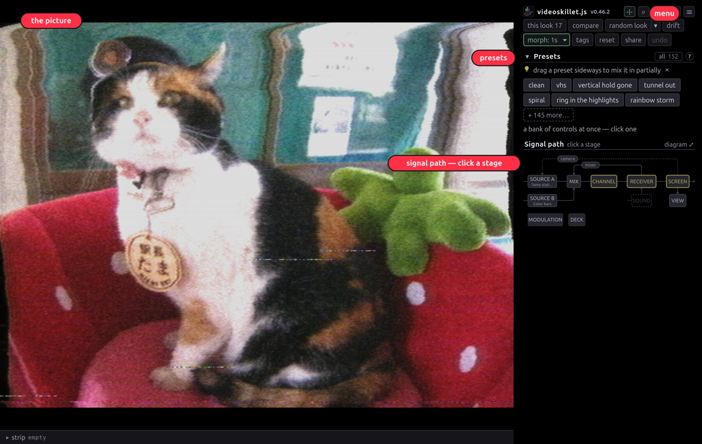

# Getting started

videoskillet.js simulates composite video signal using WebGPU shaders, and as a
result, all the video effects are just natural consequences of real signal-level
glitches, not pseudo-effects that are drawn on top of the image

It does require WebGPU which requires a fairly recent browser, try Firefox
Nightly or Chrome Canary if you have trouble with your default browser

Visit https://videoskillet.com/

## What's on screen

**1** the picture, where a drag boxes a region to magnify and a double-click
pulls back · **2** the ☰ menu, for stills, recording, fullscreen and settings ·
**3** presets · **4** the way into every control, sources included.

Controls sit where they belong on the signal path. The chain map at the top of
the sidebar is that path, and every box on it is a button.

## Three looks to try

|                                                                                          |                                                                                           |                                                                            |
| :--------------------------------------------------------------------------------------: | :---------------------------------------------------------------------------------------: | :------------------------------------------------------------------------: |
|  |  |  |

**negative** reverses polarity on the composite line, and sync goes with it ·
**key sweep** runs the video synth through the chroma keyer, with no camera
anywhere in it · **mixer loop** patches the composite into itself past unity,
where it stops returning your picture and starts breeding its own.

## Where next

- [User guide](USER-GUIDE.md) — sources, feedback, modulation, saving, scopes
- [Features](FEATURES.md) — the tour of everything it can break
- [Effects](EFFECTS.md) — every control, generated from the app's own table
- [How it works](HOW-IT-WORKS.md) — the code: one array and a chain of GPU
  shaders
- [MIDI](MIDI.md) — setting up a controller
