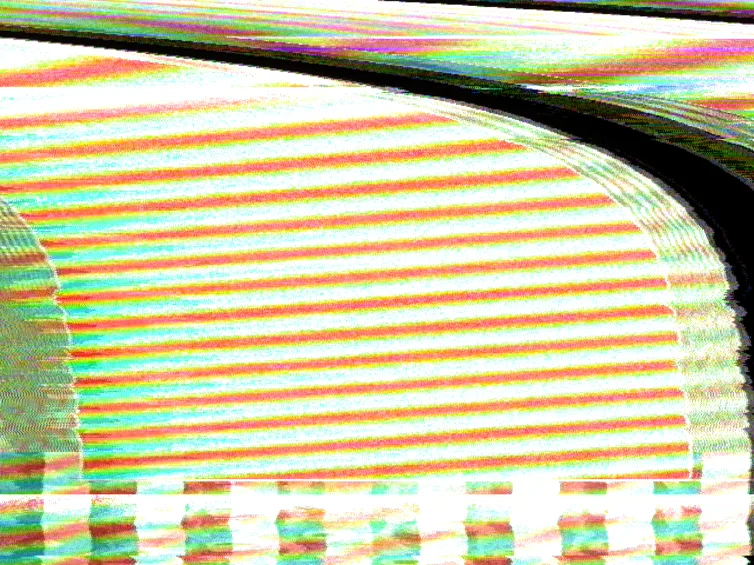
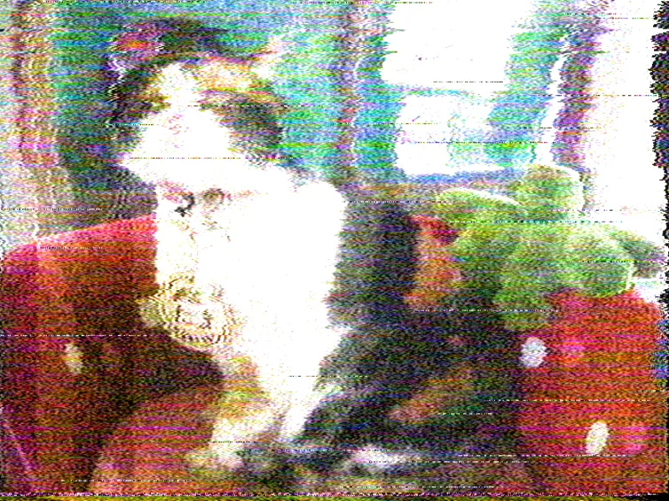
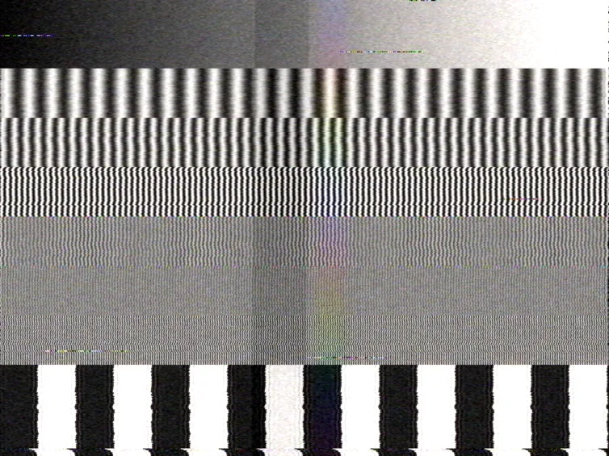

# Rendering to a file

`pnpm render` runs the signal path over a file with no browser in the room. A
look goes in as a link off the app, a clip or a still goes in as a file, and
what comes out is ProRes 4444 that an editor opens.

```
pnpm render in.mp4 out.mov --look='<paste a link off the app>'
pnpm render photo.jpg out.mov --preset=wornTape --seconds=8
pnpm render out.mov --look='<a link that names its own source>'
```

It runs the app's own engine. The pass graph, the control table and the link
parser are the same code the tab runs, bundled so a JavaScript runtime with no
bundler in it can load them, so a look renders here as it renders on screen. The
command lives in a checkout of the repository — [Getting it](#getting-it) has
the four-line version.

The app's own **⎙ render** in the strip tray is the other way to a file, and the
one to reach for while you are performing. This page is about the other case: a
look you already have, a clip you want it over, and a file you want to cut with.

## Why it exists

The browser's encoder caps what a recording can carry, and it caps it below what
this app makes. `scripts/enccheck.mjs` measures the app's own input path against
one-pixel alternating chroma, which is what dot crawl is:

| codec               | chroma detail retained |
| ------------------- | ---------------------- |
| H.264 High 4:2:0    | 9.03 dB                |
| VP9 profile 1 4:4:4 | 27.66 dB               |
| AV1 4:4:4           | 42.63 dB               |

Those numbers are Chrome's. Firefox scores about 10 dB on every one of those
arms: it declines AV1 4:4:4, and it subsamples VP9 profile 1 on the way in
whatever profile it is asked for. So a browser recording throws away the colour
artifacts this app exists to produce, and the browser this project develops
against has no route that keeps them.

`pnpm render` hands the frames to ffmpeg, which encodes ProRes 4444 and keeps
every chroma sample.

A command line also suits the simulation. Frame N is a function of every frame
before it, because the feedback loops make it one, so a render walks the file
from the top and never seeks. That is the same property that rules out an NLE
plugin, and a command that starts at the beginning has it for free.

## Three renders

Every figure below is one frame of an actual render, made by the command printed
under it. `pnpm render:docs` regenerates them.

Half of what these looks do only reads in motion, and a still cannot show a
Lorenz attractor wandering. `pnpm render:docs:keep` writes watchable copies
beside the stills — see [Where the file goes](#where-the-file-goes).

### A link, whole



```
pnpm render out.mov --look='https://videoskillet.com/app/?p=je.CoDoBwEEAbAEAKwCAfABAKCZAgXgAw2IIwSIAyFYBrAKEjwGmAEEuB4ZVADsBgr4OiSMCQDEAQDgAgAkAUQEBAAQA9wCAMXBAgCJngIAlf4DAI3tAw&mod=bendUs:lorenz:0.390279:0.27759,hvRing:sine:0.037599:0.090209&srcb=synth&src=sweep'
```

This is the README's **Wiggity** demo, rendered from the link exactly as it is
published. Nothing was passed in: the link names its own sources, so the video
synth and the sweep pattern come up on the two decks by themselves.

The bend across the frame is the part a link carries that is easy to lose. That
look's motion lives in the modulation bay — a Lorenz attractor on `bendUs` and a
sine on `hvRing` — and the renderer reads `?mod=` with the app's own parser. A
renderer that dropped it would produce this look's **resting frame**: a still of
a patch that was supposed to wander, which looks like a picture rather than like
a bug.

### A photograph down a tape path



```
pnpm render public/sample.jpg out.mov --preset=wornTape --seconds=8
```

A still is a source like any other. ffmpeg holds the picture open for as long as
the render keeps reading, so the frame stays put while everything the chain does
to it moves: the chroma noise crawls, the dropouts land on different lines, and
the tracking servo hunts.

Nothing here is drawn onto the photograph. The colour smearing sideways off
every edge is the colour-under system's bandwidth, and the coloured speckle is
FM discriminator noise landing in the chroma passband.

### The instrument, doing its job



```
pnpm render out.mov --pattern=sweep --preset=vhs --seconds=2
```

The sweep pattern stacks gratings at 0.5, 1, 2, 3, 4.2 and 5 MHz. Sent through a
VHS deck, the bottom two survive at full contrast, the middle two fade, and the
top two are washed to flat grey — which is the deck's luma bandwidth, read
straight off the picture.

A pattern, a look and a file is a measurement, which makes the renderer an
instrument as well as an export. Keep the file and the next one is comparable.

## Options

| Flag               | Does                                               |
| ------------------ | -------------------------------------------------- |
| `--look=<url>`     | a whole address bar off the app                    |
| `--preset=<name>`  | a built-in preset by name                          |
| `--set=<k:v,…>`    | controls by name, over the above                   |
| `--seconds=<n>`    | how much to render; default is the input's length  |
| `--fps=<n>`        | output rate, default 60 — the simulation's own     |
| `--seed=<n>`       | the dice; the same seed gives the same file        |
| `--motion=<0..1>`  | the modulation bay's master amount                 |
| `--bpm=<n>`        | tempo, for routings locked to a clock              |
| `--pattern=<name>` | `bars`, `sweep` or `none`, over what the link says |
| `--codec=<name>`   | `prores`, `dnxhr`, `ffv1`, `h264` or `preview`     |
| `--audio=<mode>`   | `auto`, `buzz`, `source` or `none`                 |

`--look` takes the link whole and reads it with the app's own parser, so the
board, the modulation bay, the source mode, the caption and the seed all arrive
together. Every control name is in [Effects](EFFECTS.md).

`prores` is the default and the one to cut with. Two of the others are for a
file that has to travel. `h264` writes High 4:4:4 Predictive, which x264 encodes
and no browser will, so it stays small and still keeps its chroma — some players
decline the profile. `preview` writes ordinary 4:2:0 High with the index at the
front, which opens anywhere, and is the one to reach for when the file's job is
to play.

## Audio is part of the picture

Feed a clip's own sound in and the artifacts move with it. Bass drives vertical
hold and HV sag, level drives horizontal hold, and the waveform drives
deflection — so a look built over a track renders **differently in silence**. A
render with no audio is a render of a different board, not a quiet one.

`--audio=auto` is the default: the input's own track goes in, and the
intercarrier buzz comes back out beside it when the look asks for one. The buzz
is the picture arriving on the audio line — a bright scene buzzes louder, hum
bars beat against the field rate, and a head switch clicks on the line it
damages.

Two renders of one take are the same file, sound included. The dice come from
`--seed`, the clock is the render's own, and the audio window is cut at the
frame being rendered rather than whenever the browser's audio clock delivered
it.

## Where the file goes

The last argument is the output path, and its extension picks the container: a
`.mov` for ProRes, an `.mp4` for the H.264 arms. Nothing is written anywhere
else, and nothing is cleaned up behind you.

Length comes from the input. A clip renders for as long as it runs, `--seconds`
overrides that, and a source with no length of its own — a still, a pattern, a
link naming the synth — renders ten seconds unless told otherwise.

The figures on this page are the exception worth knowing about.
`pnpm render:docs` renders each one, keeps the still and throws the clip away,
because a megabyte-scale binary re-rendered whenever a look changes is what the
repo's clips rule exists to keep out of the history. `pnpm render:docs:keep`
writes watchable copies to `renders/` as well, which is gitignored.

## Getting it

`pnpm render` runs out of a checkout. It is a local tool, and the hosted app
cannot do it.

```
git clone https://github.com/cmdcolin/videoskillet
cd videoskillet
pnpm install
pnpm render in.mp4 out.mov --preset=vhs
```

Four things have to be on PATH. **Node** and **pnpm** build the engine bundle.
**[Deno](https://deno.com/)** runs it — the renderer drives Deno's own WebGPU,
so the shaders execute on the same hardware the tab would use, and a machine
with no working GPU driver has nothing to render on. **ffmpeg** works both ends
of the pipe, decoding the input and encoding the output.

`pnpm render` builds the bundle before every run, so there is no separate step.
The first run takes a few seconds longer than the ones after it.

## What it does not do

- **No rundown.** `--look` is one board for the whole render, where the strip
  tray is a sequence of them. Perform it in the app and use ⎙ for that.
- **Nothing it has to fetch.** A link naming a clip, a still or a random pick
  from an archive renders over whatever file was passed instead, because the
  reader of a link has neither.

---

[Editor](EDITOR.md): how the export half is built · [User guide](USER-GUIDE.md):
driving the app · [Effects](EFFECTS.md): every control
