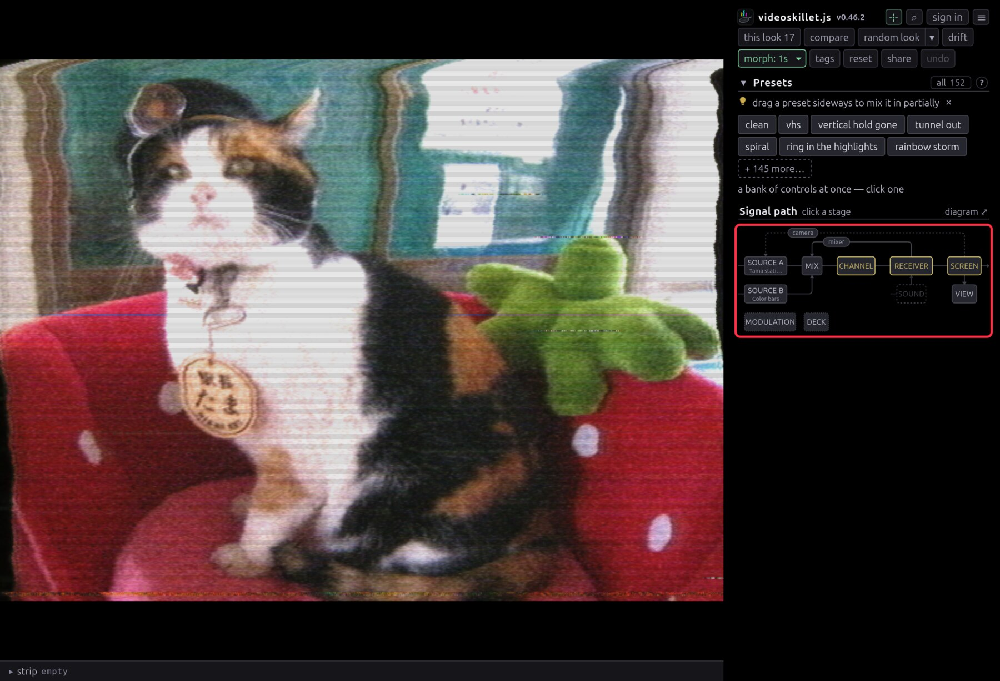
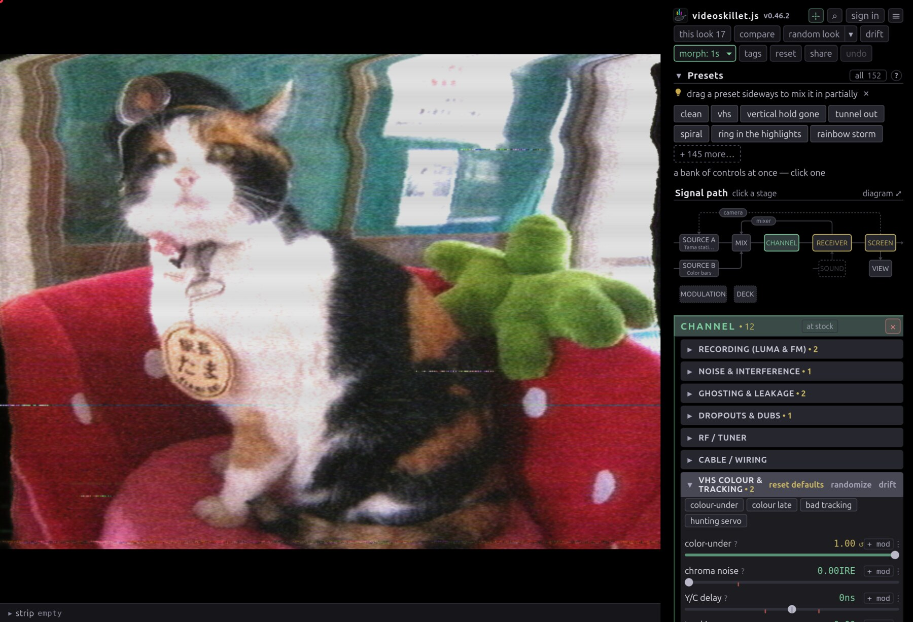

# User guide

Everything past [Getting started](GETTING-STARTED.md).

## Presets and looks

Click a preset to jump to it; drag it sideways to blend it part-way in.

- **This look** lists every control you're off stock on, as sliders. Drag to
  edit, **↺** to revert one.
- **reset** puts everything back to stock — controls, modulation bay, stab gate
  — and `ctrl+z` undoes it. **clean** is the same verb; hold `c` to preview
  clean without changing anything.
- **random look** stacks a few presets into something new. **random nudge**
  keeps your look and jogs it — everything already doing something, plus a few
  controls that weren't. `shift` for wilder, `alt` for gentler, `ctrl`/`cmd` for
  a wreck. Most good accidents start here.
- **random motion** leaves every slider where it is and re-patches the
  modulation bay instead — LFOs, drift and sample-and-hold onto controls this
  look uses. Same modifiers, `ctrl`/`cmd` cabling a bay that hunts. `ctrl+z`
  restores what it replaced.
- **more…** holds three other rolls. **random preset** draws one authored look
  whole, at its tuned strength. **random fault** throws a couple of controls a
  long way and leaves the rest alone, so the accident is one thing you can name
  and take back. **random cross** keeps some circuits of your look — tape, tube,
  sync — and rerolls the rest.
- **morph** sets how long a new look takes to arrive — cut, 1s, 4s, 8s or 30s.
  Rolls chain, so rolling every few seconds wanders continuously.
- **undo** (`ctrl+z`) steps back through all of it.

## Sources

Pick each source at the head of its stage: **A** on SOURCE A, **B** on SOURCE B,
sound on SOUND. Each picker is a menu rather than a dropdown, so picking the
entry you are already on opens it again — **File…** a second time is how you
swap one video for another, and a public archive a second time rolls another
file.

- **A** takes bars, sweep, snow, the bundled photo, a file, a shared screen, or
  a webcam — an RCA capture dongle is how real gear gets in.
- **Clips…** is a shelf of files you've opened before, folders included.
  **Public archives** rolls one from Wikimedia Commons or archive.org;
  **Browse…** searches both in a thumbnail grid.
- **Video synth** is two oscillators and a colorizer, no input. Frequency is the
  whole knob: on a multiple of line rate you get standing bars, a few hertz off
  they lean and creep, at 3.58 MHz it lands on the subcarrier and comes back as
  flat colour.
- **Teletype…** prints what you type onto a dot-matrix card; **draw** paints on
  the same page. Try the dither shades — dot crawl and chroma bleed feed on
  dither. Three switches keep the card from sitting still, which matters because
  a still card gives still artifacts: **crawl** rolls it up the frame, **boil**
  redraws it by an unsteady hand, and **garble** receives it over a wire bad
  enough to keep misspelling it.
- **B** is a second source, deliberately not genlocked, so it beats and tears
  against A. Its controls are in **Mix**.
- **♪** is audio in, and does nothing until you turn up a knob in **Sound**.

Anything with a timeline gets a **cue** button: press to mark, again to loop, a
third time to drop it. **⇤** stabs back to the cue without waiting for the lap.
`i` and `o` do the same from the keyboard, `shift` puts them on B.

**⏏ eject** clears a deck, whatever is standing in it — a clip, a camera, a test
pattern, a text card. A falls back to snow and B stops summing, and what was
there is forgotten rather than reopened next time. The button is there until the
deck is already empty, and then it is not.

A deck holding a clip gets **❚❚** beside it: that stops the deck's tape where it
stands, and **▶** rolls it on again. The bar still seeks while it is held, and
the cue and the loop survive. The **A pause** slider down in Source A is a
different machine entirely — that one freezes the picture and lets the tape run
on underneath, servo damage and mistrack stripe and all.

A reload otherwise puts each deck back on whatever it was last holding. Switch
that off in **☰ › advanced settings › on reload** for a machine other people
sit down at; the decks still remember either way, so switching it back on picks
last session's clips up again.

## Working down the chain



The map at the top of the sidebar is the signal path, and every box is a button.
Amber marks a stage you've moved something in. The three wires arcing over the
trunk are the feedback loops — camera, mixer, tape — each its own button.

**DECK** and **MODULATION** sit below the chain because they patch into the
controls, not the signal. MODULATION is the hand you set running and leave. DECK
is the hand on it now: the transition lever and its wipes, the DVE inset, both
tape transports, the tracking knob, the hold that stops the frame dead — one
surface for a take instead of four stages.

Inside a stage: **• 10** counts what you've moved, amber means off stock, **↺**
reverts, **⋮** is the wiring (pin, start an LFO, learn a MIDI knob), and
**"inert — needs …"** means another control gates this one.



**?** on any slider explains the fault it models rather than what you'll see.
The look is emergent, so the cause is what tells you how two controls combine.

The camera loop's **zoom**, **rotate**, **shift** and **gain** carry a second
button beside the **?**: **minor** drops a card under the row holding the same
knob with one step of it spread across the whole track, so a drag there moves in
hundredths of what the row above can step to. That is the resolution the loop's
geometry is actually read at — a thousandth of zoom is the difference between a
spiral that unwinds over a second and one that unwinds over ten — and the card
is where the value is printed that far in. The row keeps reading its own step,
and stays the thing a preset, a link or a MIDI knob writes.

The loops are the exception to working left to right: they take the picture off
the end and put it back at the front, compounding everything else. Here's a
camera aimed a hair off-axis from its monitor, over a tape dropping out
underneath:

<video
  controls muted loop playsinline
  poster="img/clip-feedback-poster.jpg"
  src="https://cmdcolinphotos.s3.amazonaws.com/phosphene/clip-feedback.mp4"></video>

## Finding a control

The filter box narrows the panel — `/` opens it and puts the caret in it;
`ctrl+k` opens a palette over presets, controls and actions at once. Both search
the help text, so you can hunt an artifact without knowing which knob makes it.

The **∿** on the modulation strip is the second half of the filter and a switch
rather than a word: it narrows the panel to the controls the bay is driving,
which nothing else marks, since a routing leaves the resting value alone. It
stays pressed until you press it again, it shows in the box as a **∿ moving**
token, and it narrows whatever text is already up rather than replacing it.

Either half fades the map boxes it did not reach rather than dropping them, so
the chain still reads as a chain while the panel is narrow. A faded box is still
a door: pressing one drops the filter and opens that stage, which is the
quickest way out of a filter you did not mean to apply.

## Making it move

**∿ in any control row's ⋮ menu** sets that control wobbling — LFO, random walk,
noise, sample-and-hold, a Lorenz attractor, audio level or its hits, or a
one-shot envelope you strike by hand or from a MIDI note. Depth is a fraction of
the control's range, and the slider stays put as the centre the motion happens
around, which is why a preset or a link still holds the look.

A patched row then wears its own **∿** beside the reading, and that one is a
switch: press it to hold that wobble still, press it again to start it back up
exactly as you dialed it. It is the row's mark as well as its button — a row
showing no ∿ has nothing driving it.

Once anything moves, a **modulation** strip appears with one amount over every
routing, a freeze, and the **∿** count that filters the panel down to what is
running. The top of **MODULATION** is the tempo: type or tap a BPM, then lock
any rate to it. MIDI clock takes over whenever something sends it — see
[MIDI.md](MIDI.md).

**stabs** flip the board back to clean in bursts — 60ms by default, and anywhere
from 8 to 400 — so the look pokes into a clean picture instead of running flat
out. Phosphor, the loops and the tape bin keep running through the flip, so a
stab leaves a trail.

Clean is only the gate's default far end. **⧉ hold this look** parks the current
board at that end, and the gate cuts between it and whatever you dial next — two
looks, hard-panned on the beat, no fade. The sliders belong to the live look;
the held one is a copy nothing moves. While a look is held the length row
becomes a **share**, so a tempo change holds the split, not the milliseconds: 50
is even, and pushing it either way makes one look the state and the other the
interruption. **× drop** returns the gate to stabbing clean.

Two looks never crossfade. A moving filter control redesigns the filter bank, so
a crossfade would redesign it every frame where a cut redesigns it twice a
cycle.

**Sound** hangs off Receiver, where audio patches in. Bass lurches the frame,
level tears line hold. Pick something under **♪** first or the box opens onto
nothing.

## Keeping what you find

**saved** is your library, kept on your account, so it needs a sign-in.
`ctrl/⌘+S` saves, and the first nine sit on the number keys — `1–9` recalls,
`shift+1–9` overwrites.

A recall brings back the controls and the motion and leaves your input alone.
**⧉** copies a link carrying both, source clip included. `s` saves a still, `r`
records a clip.

### The link is the look

The address bar carries the whole look at all times — every control off stock,
what is moving in the bay, the source and its cue — so copying it is the share
button and reloading keeps what you had.

It comes out short. Here is **worn tape**, whole:

```
https://cmdcolin.github.io/ntsc.js/?p=FbQBJbABEXAAmAIN8AEAPAKQAwDoAgCQAwBkAEgBwAIAgAEGwAIA6AIBCA&mod=
```

That is the look written as bytes. `?set=` says the same thing by name, and the
app both reads and writes it:

```
https://cmdcolin.github.io/ntsc.js/?set=noiseIre:9,hHold:0.2,chromaGain:1.79
```

Three times the characters for the same look, which is why the bar carries the
short one — the difference between a link that survives a chat window and one
that arrives in three pieces. Written out, worn tape runs to 248.

What the long form buys is a look you can program by hand: a control name from
[EFFECTS.md](EFFECTS.md), a colon, a number, commas between. Anything left out
is at stock, anything out of range is pulled back onto the panel, and a name the
app no longer has is dropped. A bar already carrying `?set=` keeps carrying it,
so the look stays readable while you are working that way rather than turning to
bytes under the cursor — type a bare `?set=` to switch a tab over.

## Looking closer

Drag a box on the picture to zoom, double-click to reset. The magnifier is part
of the display, so it magnifies the lit tube face too — scan lines, mask and
all.

To watch the signal itself, **signal tap** in the View group steps through the
composite waveform, luma, chroma energy, burst state, the scope, and back. The
live tap is named on the ☰ button, so a screen full of waveform never looks
like a fault.

**scope** is the one to reach for first. It lays a single line out left to
right, sync tip and burst included, against an IRE graticule. Sync depth, setup,
AGC pumping and a burst that has stopped being 40 IRE are readable there rather
than inferred — turning a knob and watching the waveform is the fastest way to
understand it.

## Getting it out

The ☰ menu has stills, recording, fullscreen, and **pop out controls**, which
moves the panel to a second window and gives the picture the whole screen. Point
OBS at the picture window for anything you care about.

## Keyboard

| Key                     | Does                                                                |
| ----------------------- | ------------------------------------------------------------------- |
| `ctrl/⌘+k`              | command palette                                                     |
| `/`                     | filter the controls                                                 |
| `c` (hold)              | preview the clean signal                                            |
| `r` / `s`               | record a clip / save a still                                        |
| `f`                     | fullscreen                                                          |
| `i`                     | cue a clip · press again to loop from there · `+shift` for source B |
| `o`                     | stab back to the cue · `+shift` for source B                        |
| `t`                     | strike every one-shot envelope in the bay                           |
| `1`–`9` / `shift+1`–`9` | recall / overwrite one of your first nine saves                     |
| `ctrl/⌘+z`              | step back a look · `+shift` or `ctrl/⌘+y` steps forward again       |
| `esc`                   | close a dialog, cancel a MIDI arm, clear the filter                 |

---

[Features](FEATURES.md) — everything it can break · [Effects](EFFECTS.md) —
every control · [How it works](HOW-IT-WORKS.md) — the code · [MIDI](MIDI.md) —
setting up a controller
