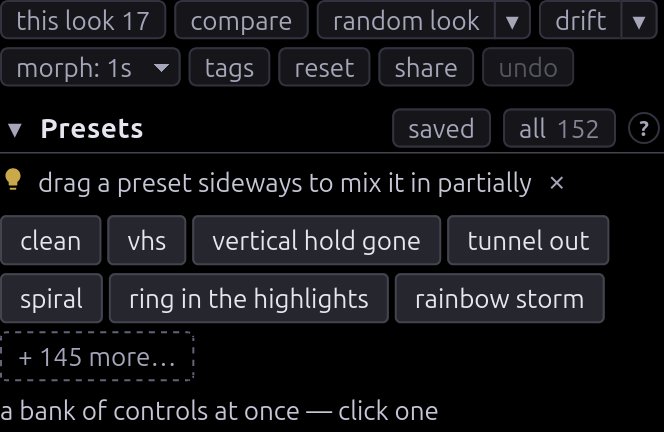

# User guide

Everything past [Getting started](GETTING-STARTED.md).

## Presets and looks

Click a preset to jump to it. Drag it sideways to blend it part-way in.



- **this look** opens a menu listing every control you're off stock on, as
  sliders. Drag to edit, **↺** to revert one, `ctrl+z` puts back what ↺ took. It
  is a menu so the panel never grows under your pointer as you edit.
- **reset** puts everything back to stock (controls, modulation bay, stab gate)
  and `ctrl+z` undoes it. **clean** does the same thing. Hold `c` to preview
  clean without changing anything.
- **random look** stacks a few presets into something new. **random nudge**
  keeps your look and moves it a little: everything already doing something,
  plus a few controls that weren't. `shift` for wilder, `alt` for gentler,
  `ctrl`/`cmd` for a wreck. The best way to find something new.
- **random motion** leaves every slider where it is and re-patches the
  modulation bay, putting LFOs, drift and sample-and-hold onto controls this
  look uses. Same modifiers, with `ctrl`/`cmd` giving a bay that never settles.
  `ctrl+z` restores what it replaced.
- The **▾** beside the roll button holds all six, ordered by how much of your
  look survives. Picking one rolls it and leaves it on the button, so going
  again is one press. **random preset** draws one authored look whole, at its
  tuned strength. **random fault** throws a couple of controls a long way and
  leaves the rest, so the change is one thing you can name and take back.
  **random cross** keeps some circuits of your look (tape, tube, sync) and
  rerolls the rest.
- **drift** is the random nudge running on its own. Press once (or `d`) and the
  look wanders: a gentle nudge every 15 seconds, travelling most of the way each
  time, so the picture keeps moving and never cuts. It stays near the look you
  set it going on, however long you leave it. Press again to stop where it got
  to; `ctrl+z` then restores the look you started on, since none of the legs
  between is stored. Each stage heading has the same switch for its own
  controls, so the tape path can wander while you dial the sync card by hand.
  Pressing one takes over from the other, since a control wanders around one
  look at a time. For a wander that is part of a piece, use the strip's shake
  row: it holds in bars, is seeded and is saved.
- **morph** sets how long a new look takes to arrive: cut, 1s, 4s, 8s or 30s.
  Rolls chain, so rolling every few seconds wanders continuously.
- **undo** (`ctrl+z`) steps back through all of it.

## Sources

Pick each source at the head of its stage: **A** on SOURCE A, **B** on SOURCE B,
sound on SOUND. Each picker is a menu, so choosing the entry you are already on
opens it again — picking **File…** twice is how you swap one video for another.

- **A** takes bars, sweep, snow, the bundled photo, a file, a shared screen or a
  webcam — which is how an RCA capture dongle gets real gear in. B takes the
  same list plus **Off**.
- **Clips…** is a shelf of files you've opened before, folders included.
  **Public archives** rolls one from Wikimedia Commons or archive.org;
  **Browse…** searches both in a thumbnail grid.
- On an archive, the deck grows **roll photo** / **roll clip** buttons under the
  file's name. Commons holds both, and they differ: a still gives still
  artifacts, a clip moving ones. archive.org holds footage only, so it gets
  **roll clip** alone. **☆** keeps that file on your clip shelf; the next roll
  takes it off the deck either way, and **↗** opens its page upstream, where the
  licence and the photographer are.
- **Video file URL…** plays an `.mp4` or `.webm` straight from its address, with
  no download step. The server has to allow cross-origin reads; if it doesn't,
  the clip plays and the picture stays black.
- **Video synth** is two oscillators and a colorizer, with no input. Frequency
  is the main control. On a multiple of line rate you get standing bars, a few
  hertz off they lean and creep, and at 3.58 MHz it lands on the subcarrier and
  comes back as flat colour.
- **Teletype…** prints what you type onto a dot-matrix card; **draw** paints on
  the same page. Try the dither shades — dot crawl and chroma bleed respond
  strongly to dither. Three switches keep the card moving, which matters because
  a still card gives still artifacts: **crawl** rolls it up the frame, **boil**
  redraws it by an unsteady hand, **garble** receives it over a wire bad enough
  to keep misspelling it.
- **B** is a second source, deliberately not genlocked, so it beats and tears
  against A. Its controls are in **Mix**.
- **♪** is audio in, and does nothing until you turn up a knob in **Sound**. It
  takes the mic, a file you pick, the clip already on screen, or **system
  audio** — a share of the tab or app this machine is playing out of, which
  drives the picture from a track with no room in between.

Anything with a timeline gets a **cue** button: press to mark, again to loop, a
third time to drop it. **⇤** stabs back to the cue without waiting for the lap.
`i` and `o` do the same from the keyboard, `shift` puts them on B.

**⏏ eject** clears a deck, whatever is in it: a clip, a camera, a test pattern,
a text card. A falls back to snow, B stops summing, and what was there is
forgotten rather than reopened next time. The button hides once the deck is
empty.

A deck holding a clip gets **❚❚**: that stops the deck's tape where it stands,
and **▶** rolls it on again. The bar still seeks while it is held, and the cue
and the loop survive. The **A pause** slider in Source A is a different thing —
it freezes the picture and lets the tape run on underneath, with servo damage
and a mistrack stripe.

A reload otherwise puts each deck back on what it was last holding. Switch that
off in **☰ › advanced settings › on reload** for a shared machine. The decks
remember either way, so switching it back on brings last session's clips back.

## Working down the chain


The map at the top of the sidebar is the signal path, and every box is a button.
Amber marks a stage you've moved something in. The wires arcing over the trunk
are the feedback loops (camera, mixer), and the chip on each one is that loop's
button.


**DECK** and **MODULATION** sit below the chain because they patch into the
controls rather than the signal. MODULATION holds the automation you set running
and leave. DECK holds what you use live during a take: the transition lever and
its wipes, the DVE inset, both tape transports, the tracking knob, and the hold
that stops the frame. One surface instead of four stages.

Inside a stage: **• 10** counts what you've moved, amber means off stock, **↺**
reverts, **+ mod** sets the control moving, **⋮** holds the rest of the wiring
(pin, learn a MIDI knob, lock to the beat), and **"inert: needs …"** means
another control gates this one.

Every stage heading carries its own buttons, which act on that stage only.
**randomize** nudges its controls around where they sit, with the same modifiers
the whole-board rolls take, and holding it down keeps nudging slowly until you
let go. **drift** sets the stage wandering on its own, so one circuit moves
while the rest of the board holds still. Press it again to stop it where it is.
**reset defaults** appears once there is something to put back.


**?** on any slider explains the fault it models rather than what you'll see.
The look is emergent, so knowing the cause is what tells you how two controls
combine.

The camera loop's **zoom**, **rotate**, **shift** and **gain** carry a second
button beside the **?**. **minor** drops a card under the row with one step of
the same knob spread across the whole track, so a drag there moves in hundredths
of what the row above reaches — the resolution the loop's geometry is read at. A
thousandth of zoom is the difference between a spiral that unwinds over a second
and one that takes ten, and the card shows the value to that precision. The row
keeps its own step and stays what a preset, a link or a MIDI knob writes.

The loops are the exception to working left to right. They take the picture off
the end and put it back at the front, compounding everything else. Here is a
camera aimed slightly off-axis from its monitor, over a tape dropping out
underneath:

<video
  controls muted loop playsinline
  poster="img/clip-feedback-poster.jpg"
  src="https://cmdcolinphotos.s3.amazonaws.com/phosphene/clip-feedback.mp4"></video>

## Finding a control

The filter box narrows the panel. `/` opens it with the caret in it, and
`ctrl+k` opens a palette over presets, controls and actions at once. Both search
the help text, so you can hunt an artifact without knowing which knob makes it.
The palette stands in the panel, leaving the picture beside it clear.

The count on the modulation strip (**2 mod**) is a filter as well as a readout.
Press it and the panel narrows to the controls the bay is driving, which nothing
else marks, since a routing leaves the resting value alone. It stays pressed
until pressed again, shows in the box as a **mod only** token, and narrows
whatever text is already up.

Either filter fades the map boxes it did not match rather than hiding them, so
the chain still reads as a chain. A faded box is still clickable, and pressing
one drops the filter and opens that stage — the quickest way out of a filter you
did not mean to apply.

## Making it move

**+ mod**, beside the reading on a control row, sets that control moving: it
patches a slow sine drift and unfolds an editor where you pick the source (LFO,
random walk, noise, sample-and-hold, a Lorenz attractor, audio level or its
hits, or a one-shot envelope you trigger by hand or from a MIDI note) and dial
the rate and depth. Depth is a fraction of the control's range, and the slider
stays put as the centre the motion happens around, which is why a preset or a
link still holds the look. The first press goes as deep as that control wants:
half a percent of the range on the vertical roll rate, a third of it on
horizontal hold. The rate's **♩ lock to beat** button ties it to the tempo
instead of Hz.

Two kinds of row have no button. The View controls, since a wobbling magnifier
or a stuttering clock reads as the app breaking. And a strobe or a paperclip
resting at zero, where the only thing a wobble can do is start the full-field
flash. Dial either up and the button is back.

A patched row then carries two buttons in place of **+ mod**: a chip naming the
routing (**sine 0.08Hz**) that opens its editor, and a **❚❚** that holds the
wobble still without unpatching it. Held, the chip dims and the button reads
**▶**; press it and the motion is back as you dialed it. **remove** in the
editor, or in the row's **⋮**, frees the slot.

Once anything moves, a **mod amount** strip appears with one amount over every
routing, a freeze, and the **mod** count that filters the panel to what is
running. The **MODULATION** box on the map lists every routing with the same
editor under each, and the tempo at its top. Type or tap a BPM, then lock any
rate to it. MIDI clock takes over whenever something sends it. See
[MIDI.md](MIDI.md).

**stabs** flip the board back to clean in bursts, 60ms by default and anywhere
from 8 to 400, so the look cuts into a clean picture instead of running
continuously. Phosphor and both feedback loops keep running through the flip, so
a stab leaves a trail.

Clean is only the gate's default far end. **⧉ hold this look** parks the current
board at that end, and the gate cuts between it and whatever you dial next: two
looks, hard cut on the beat, no fade. The sliders belong to the live look; the
held one is a copy nothing moves. While a look is held the length row becomes a
**share**, so a tempo change keeps the split rather than the milliseconds. 50 is
even; pushing it either way makes one look the resting state and the other the
interruption. **× drop** returns the gate to stabbing clean.

Two looks never crossfade. A moving filter control rebuilds the filter bank, so
a crossfade would rebuild it every frame where a cut rebuilds it twice a cycle.

**Sound** hangs off Receiver, where audio patches in. Bass lurches the frame and
level tears line hold. Pick something under **♪** first, or the box has nothing
to work with.

**System audio** asks for a share, the only way a page can hear the machine:
pick a tab and tick _Also share tab audio_, or the share arrives silent and the
picker says so. Not every browser can send audio through a share — Chrome can.
Ending the share from the browser's own bar puts the picker back to off, since a
dead capture and a quiet room look the same from here.

Under the picker is the one thing in the app that comes out of your speakers:
the set's own intercarrier buzz, the picture arriving on the audio line. It
starts **silent** and stays there until you switch it to **buzz out loud**,
because its level is two controls — _sound buzz_ under **Channel · Ghosting &
leakage** and _fine tuning_ under **Channel · RF / Tuner** — and a preset, a
shared link or a random roll can raise either without anyone having asked for
noise. The switch is remembered between visits.

## Playing a piece

The **strip** tray along the bottom of the window is a rundown: a list of looks
that plays itself. Set the board up, press **+ row**, and do it again. **▶
play** then walks the rows from the top, each holding for its own count and
arriving its own way.


A row is the session the address bar carries — the look, the modulation bay, the
source and its cue — plus how long it holds and how it arrives. Clicking a card
fires that row on its own, so one list serves a piece that plays itself and a
bank of scenes you play by hand.

Three kinds, marked by the glyph on the card:

- **▤ a clip**: this source, this look, these cue points.
- **⟳ a roll**: a pool rather than a file, drawn when the row fires, so you know
  the kind of thing that is coming without knowing which one.
- **⚄ a shake**: keeps whatever is up and jitters the look instead. **+ shake**
  adds one.

The chips along the foot of a card are its timing, and each steps when you click
it:

- **How long it holds.** **≈4 bars** is loose: the boundary lands anywhere
  within a quarter of the count either way, so a rundown played twice is two
  different videos. **4 bars** with the drift off is the exact lock, for a cut
  that has to land on a hit. **whole clip** runs as long as the picture does,
  trimmed to the cue when there is one, and **hold** waits for a hand.
- **How the look arrives**: a cut, or a morph over 1, 4, 8 or 30 seconds.
- **What it arrives behind**: a transition from the list, drawn as its glyph.
  **track** sweeps a band of head noise up the frame and swaps the clip under
  it, **roll** loses vertical hold and cuts mid-roll, **collapse** folds the
  raster toward a line and opens it out, **shuttle** runs the transport away,
  **dub** piles up generations so the new clip arrives already worn. Each is the
  board dialled into a fault and back out, so it compounds with the look rather
  than covering it.

**✎** names a row, **⧉** copies it, **✕** takes it out, and dragging a card by
its face reorders the rundown. **↶ ↷** step the rundown's own edits, a separate
stack from `ctrl+z`, which stays with the board.

Bars come from the tempo, tapped or off MIDI clock, so a rundown cut to music
follows the music. **♪** picks that track and **▶** starts it from the top with
the walk. **↻ loop** comes back round at the end. **seed** is what every roll
and shake draws from: press it for a new one and the same rundown plays a
different video. It is printed, so a take worth finding again can be found.

## Keeping what you find

**saved** is your library, kept on your account, so it needs a sign-in.
`ctrl/⌘+S` saves, and the first nine sit on the number keys: `1–9` recalls,
`shift+1–9` overwrites.

A recall brings back the controls and the motion and leaves your input alone.
**⧉** copies a link carrying both, source clip included. `s` saves a still, `r`
records a clip.

### The link carries the look

The address bar carries the whole look at all times — every control off stock,
what is moving in the bay, the source and its cue — so copying it is the share
button and reloading keeps what you had.

The source travels as far as a string can carry it. A pattern, a text card and a
pasted video address go whole. An archive clip goes as its identifier, so a link
sent while a Commons or archive.org file is on screen opens on _that_ file
rather than the reader's own roll. A clip from your disk or your clip list
cannot travel, since the reader has neither, so a link made on one opens on
whatever else it names.

It comes out short. Here is **worn tape**, whole:

```
https://videoskillet.com/app/#p=mD.FbQBJbABEXAAmAIN8AEAPAKQAwDoAgCQAwBkAEgBwAIAgAEGwAIA6AIBCA&mod=
```

That is the look written as bytes, behind a two-character checksum. A link that
arrives truncated or with a character changed is refused with a notice rather
than opened on a picture nobody made. `#set=` says the same by name, and the app
reads and writes it:

```
https://videoskillet.com/app/#set=noiseIre:9,hHold:0.2,chromaGain:1.79
```

Written out, worn tape runs to 248 characters — three times the packed form, and
the difference between a link that survives a chat window and one that arrives
in three pieces. Hence the short one in the bar.

The long form buys a look you can program by hand: a control name from
[EFFECTS.md](EFFECTS.md), a colon, a number, commas between. Anything left out
is at stock, anything out of range is pulled back onto the panel, and a name the
app no longer has is dropped. A bar already carrying `#set=` keeps carrying it,
so the look stays readable while you work that way. Type a bare `#set=` to
switch a tab over. Either sigil is read, so every one of these also opens
spelled `?`.

### Starting a loop the reader cannot see

A look travels; a running feedback loop does not. What the loops have built is
in video memory, and the reader's page comes up with it empty, so a board that
lives on what it is amplifying opens black and stays there, reading as a broken
link. **start it with a burst of snow** in the share box is the fix: the link
opens on a second and a half of snow, the loops take hold of it, and the burst
heals off, leaving the look the link says running on what it started.

It is the same move as waving a hand in front of a camera pointed at its own
monitor, and it is snow rather than a flash for the same reason a hand works
better than a lamp: a loop amplifies detail, and a flat field has none.

## Looking closer

Drag a box on the picture to zoom, double-click to reset. The magnifier is part
of the display, so it magnifies the lit tube face too — scan lines, mask and
all.

To watch the signal itself, **signal tap** in the View group steps through the
composite waveform, luma, chroma energy, burst state, the scope, and back. The
live tap is named on the ☰ button, so a screen full of waveform is never
mistaken for a fault.

**scope** is the one to try first. It lays a single line out left to right, sync
tip and burst included, against an IRE graticule. Sync depth, setup, AGC pumping
and a burst that is no longer 40 IRE are readable there. Turning a knob and
watching the waveform is the fastest way to understand it.

## Getting it out

`s` saves a still and `r` records the picture as it plays; both land as files
when they finish. The recording is an H.264 MP4 written at a constant 60, from
whatever frames the tab managed, so a run that dropped frames comes back playing
fast.

**⎙ render** in the strip tray is the other way to a file, and the one an editor
imports cleanly. It takes the frames off the screen and steps the engine on its
own clock, so it runs as fast as the GPU allows and the timing in the file is
the simulation's. It renders the recorded take if there is one, else the length
of the track, else the whole rundown at the lengths its rows hold for, else ten
seconds; the button says which. Two renders of one take are the same file, since
a take starts from a fresh signal state on the tray's seed.

**● rec** records the hands rather than the picture — every slider, preset,
controller knob and morph, against the frame it happened on — and **⎙** replays
that into the render, so a run performed at whatever rate the tab managed comes
back at 60. It works over a bare clip with no rundown. The **⏺** readout beside
it is the take's length; clicking it discards the take.

The ☰ menu has stills, recording, fullscreen, and **pop out controls**, which
moves the panel to a second window and gives the picture the whole screen. Point
OBS at the picture window to capture it.

## Keyboard

| Key                     | Does                                                                |
| ----------------------- | ------------------------------------------------------------------- |
| `ctrl/⌘+k`              | command palette                                                     |
| `/`                     | filter the controls                                                 |
| `c` (hold)              | preview the clean signal                                            |
| `r` / `s`               | record a clip / save a still                                        |
| `f`                     | fullscreen                                                          |
| `i`                     | cue a clip · press again to loop from there · `+shift` for source B |
| `o`                     | stab back to the cue · `+shift` for source B                        |
| `t`                     | strike every one-shot envelope in the bay                           |
| `d`                     | set the whole board drifting · press again to stop where it got to  |
| `ctrl/⌘+s`              | save this look to your library                                      |
| `1`–`9` / `shift+1`–`9` | recall / overwrite one of your first nine saves                     |
| `ctrl/⌘+z`              | step back a look · `+shift` or `ctrl/⌘+y` steps forward again       |
| `esc`                   | close a dialog, cancel a MIDI arm, clear the filter                 |

---

[Features](FEATURES.md): everything it can break · [Effects](EFFECTS.md): every
control · [MIDI](MIDI.md): setting up a controller ·
[How it works](FAQ.md#how-does-it-actually-work): the code
